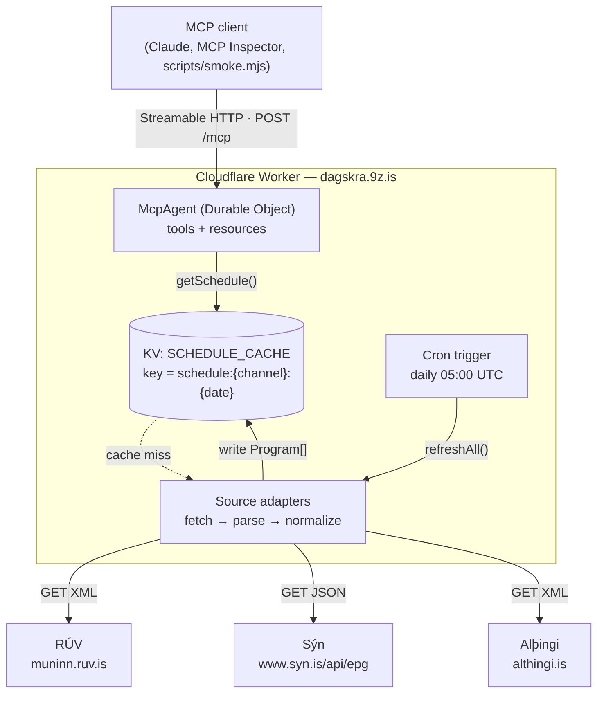
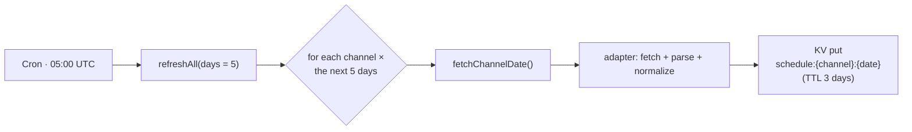
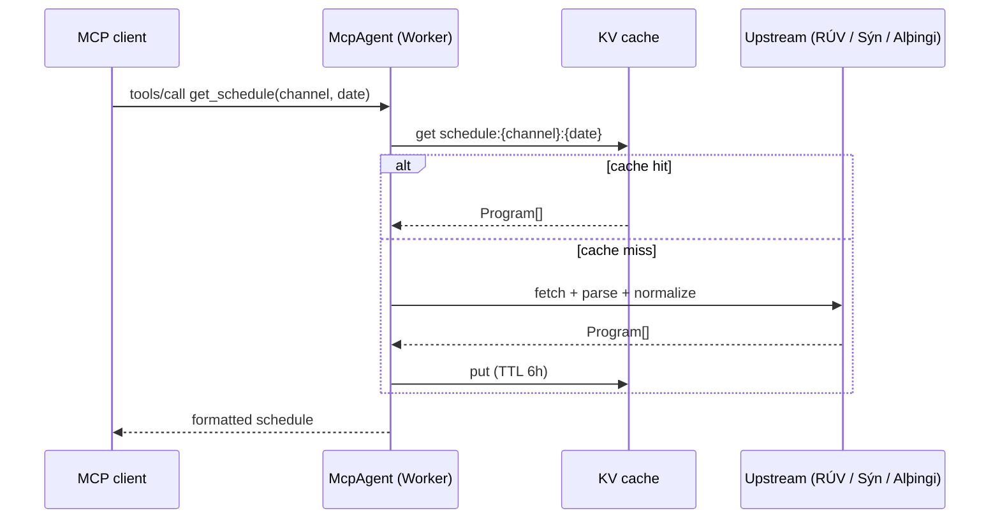

# dagskra-mcp

A **remote [MCP](https://modelcontextprotocol.io) server** that exposes the broadcast
schedule (*dagskrá*) of Icelandic TV channels. It runs on a Cloudflare Worker and is served
over the public internet at **`https://dagskra.9z.is/mcp`** — clients connect over the
network, so there is nothing to install locally.

It currently covers **22 channels** across three broadcasters:

| Station | Channels |
| --- | --- |
| **RÚV** (national broadcaster) | RÚV, RÚV 2 |
| **Sýn** (formerly the Stöð 2 group) | Sýn; Sýn Sport, Sýn Sport 2–6; Sýn Sport Ísland (+ 2–5); Sýn Sport Viaplay; KKI TV 1–6 |
| **Alþingi** (parliament) | Alþingi — broadcasts of parliamentary sittings (carried on RÚV 2) |

> The higher Sýn Sport Ísland / KKI TV numbers are per-event overflow channels: they only
> carry programming when several events are live at once and are empty otherwise. Sjónvarp
> Símans is not covered — it has no publicly readable schedule feed.

---

## Connecting a client

dagskra is a **remote** MCP server over **Streamable HTTP** at `https://dagskra.9z.is/mcp` —
nothing to install and no API key (it's public and read-only). Add it to your client:

### Claude Code (CLI)

```bash
claude mcp add --transport http dagskra https://dagskra.9z.is/mcp
```

Add `-s user` to make it available in every project. Check it with `/mcp` inside Claude Code.

### Claude Desktop

**Settings → Connectors → Add custom connector**, then paste `https://dagskra.9z.is/mcp`.

If your build has no custom-connector UI, bridge it through `mcp-remote` in
`claude_desktop_config.json` and restart the app:

```json
{
  "mcpServers": {
    "dagskra": {
      "command": "npx",
      "args": ["mcp-remote", "https://dagskra.9z.is/mcp"]
    }
  }
}
```

### Codex CLI

Add to `~/.codex/config.toml` (Codex's `codex mcp add` is stdio-only, so edit the file directly for a remote server):

```toml
[mcp_servers.dagskra]
url = "https://dagskra.9z.is/mcp"
```

### GitHub Copilot CLI

Run `/mcp add` in the CLI, choose **HTTP**, set the URL to `https://dagskra.9z.is/mcp`, leave
tools as `*`, and press Ctrl+S. Or add it to `~/.copilot/mcp-config.json`:

```json
{
  "mcpServers": {
    "dagskra": {
      "type": "http",
      "url": "https://dagskra.9z.is/mcp",
      "tools": ["*"]
    }
  }
}
```

Once connected, try *"What's on RÚV tonight?"* or call `get_schedule` with `{"channel": "ruv"}`.

---

## Architecture



The design separates **gathering** the schedule from **serving** it:

- A **Cron trigger** fetches every channel for the next few days once a day and writes the
  normalized result into **Workers KV**.
- The **MCP server reads from KV**, so queries are fast and stay up even when an upstream
  feed is slow or down. (Sýn's API in particular is a serverless scraper that occasionally
  stalls — caching is what makes it dependable.)
- The MCP server itself is an `McpAgent` from the [Cloudflare Agents SDK](https://developers.cloudflare.com/agents/),
  which runs as a **Durable Object** (one instance per MCP session) and speaks the
  **Streamable HTTP** transport on `/mcp`.

If a query asks for a channel/day that isn't cached yet, the server fetches it on demand
(**fetch-on-miss**) and caches the result, so it is never wrong — only occasionally slower.

---

## How the schedule data is gathered

Despite the word "scraping," most of the work is consuming **structured feeds** and
mapping them onto one common shape. Each broadcaster has a dedicated adapter in
`src/sources/`, and both produce a `Program[]` (defined in `src/schema.ts`).

### Sources

| Broadcaster | Endpoint | Format | Notes |
| --- | --- | --- | --- |
| **RÚV** | `https://muninn.ruv.is/files/xml/{slug}/{from}/{to}/` | XML | Official schedule files ("dagskrárskjöl"). Supports date ranges. Slugs: `ruv`, `ruv2`. |
| **Sýn** | `https://www.syn.is/api/epg/{slug}/{YYYY-MM-DD}` | JSON | Sýn plus 18 sport channels (`syn`, `synsport`–`synsport6`, `synsportisland`(+`2`–`5`), `synsportviaplay`, `kkitv1`–`6`). A Vercel-hosted function that can be slow. |
| **Alþingi** | `https://www.althingi.is/altext/xml/dagskra/` | XML (ISO-8859-1) | Official parliamentary sitting agenda. Sparse — usually just the next sitting; no scheduled end. |

### Normalization

Both adapters map their source onto the same `Program` interface:

```ts
interface Program {
  channel: string;      // our canonical id, e.g. "ruv"
  station: string;      // "RÚV" | "Sýn" | "Alþingi"
  start: string;        // ISO 8601 UTC
  end: string;          // ISO 8601 UTC
  title: string;
  originalTitle?: string;
  description?: string;
  category?: string;
  series?: { season?: number; episode?: number; total?: number };
  live?: boolean;
  premiere?: boolean;   // from Sýn's `frumsyning`
  rerun?: boolean;      // from RÚV's <rerun>
  rating?: string;
}
```

- **RÚV** (`src/sources/ruv.ts`): parse the XML with `fast-xml-parser`, then map each
  `<event>` — `start-time` + `duration` → `start`/`end`, plus title, category, episode
  numbers, `<rerun>`, and a description that falls back to the `<details>` block.
- **Sýn** (`src/sources/syn.ts`): map each JSON record — `upphaf` + `slotlengd` →
  `start`/`end`, the Icelandic `isltitill` as the title, `lysing` as the description, and
  the `beint` / `frumsyning` / `bannad` flags.
- **Alþingi** (`src/sources/althingi.ts`): decode the ISO-8859-1 XML and map each sitting
  (`fundur`) to one program at its start time, with the agenda items folded into the
  description (sittings have no scheduled end, so `end = start`).

> **Time zones:** Iceland observes UTC year-round (no DST), so an Icelandic local time *is*
> the UTC time. RÚV's `2026-05-23 07:00:00` becomes `2026-05-23T07:00:00Z` directly, and all
> `Program` times are UTC.

### Caching



`src/cache.ts` owns all cache logic:

- **Key:** `schedule:{channelId}:{date}` → a JSON `Program[]`.
- **Daily warm** (`refreshAll`): the cron fetches every channel for the next 5 days (channels
  publish a few days ahead) and writes each with a 3-day TTL.
- **Fetch-on-miss** (`getSchedule`): a query for an uncached key fetches live, then caches it
  with a 6-hour TTL.

### A query, end to end



---

## MCP surface

### Tools

| Tool | Arguments | Purpose |
| --- | --- | --- |
| `list_channels` | — | List the available channels. |
| `get_schedule` | `channel`, `date?` | A channel's schedule for a day (defaults to today, Icelandic time). |
| `whats_on` | `channel`, `at?` | Current and next program (optionally at a given ISO time). |
| `search_programs` | `query`, `days?`, `channels?` | Search titles/descriptions across channels over the next few days. |

### Resources

| URI | Purpose |
| --- | --- |
| `dagskra://channels` | The channel catalog (small, stable — load once). |
| `dagskra://schedule/{channel}/{date}` | One channel/day as an addressable, cacheable document (resource template). |

Tools cover *queries and search*; resources expose *addressable schedule documents* a client
can browse, attach, and cache by URI.

---

## Project layout

```
src/
  index.ts        Worker entry — routes /mcp and /health; scheduled() runs the cron
  mcp.ts          DagskraMCP extends McpAgent — registers tools + resources
  cache.ts        KV read (fetch-on-miss) + refreshAll() daily warm
  channels.ts     channel registry (id → source adapter + upstream slug)
  schema.ts       the normalized Program type
  env.ts          Worker bindings (SCHEDULE_CACHE, MCP_OBJECT)
  sources/
    ruv.ts        RÚV muninn XML → Program[]
    syn.ts        Sýn syn.is JSON → Program[]
    althingi.ts   Alþingi agenda XML → Program[]
test/
  sources.test.ts parser unit tests (deterministic, offline)
scripts/
  smoke.mjs       Streamable-HTTP client to exercise the server end-to-end
```

---

## Local development

```bash
npm install
npm run dev            # wrangler dev — serves http://localhost:8787/mcp (local KV simulation)
```

Test the running server **without loading it into a chat client**:

```bash
# scripted JSON-RPC client (defaults to localhost; override with MCP_URL)
node scripts/smoke.mjs
MCP_URL=https://dagskra.9z.is/mcp node scripts/smoke.mjs

# or the interactive MCP Inspector — set Transport: "Streamable HTTP", URL: the /mcp endpoint
npx @modelcontextprotocol/inspector
```

```bash
npm test               # vitest — offline parser tests
npm run type-check     # tsc --noEmit
```

---

## Deployment

Deployed manually with Wrangler (no CI). The Worker, KV namespace, Durable Object, custom
domain (`dagskra.9z.is`), and daily cron are all configured in `wrangler.jsonc`.

```bash
npx wrangler login                              # one-time auth
npx wrangler kv namespace create SCHEDULE_CACHE # one-time; id goes in wrangler.jsonc
npx wrangler deploy
```

The SQLite-backed Durable Object that `McpAgent` uses is available on the Workers Free plan.
